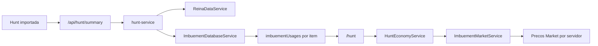
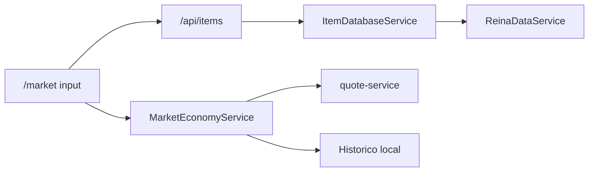
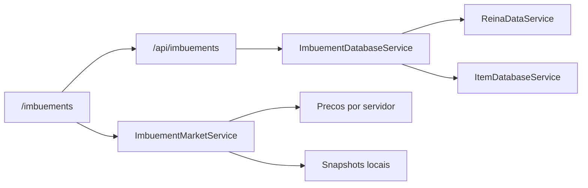

# REINAHUB_DATA_FLOW

Mapa de fluxo de dados do ReinaHub.

Objetivo: evitar paginas duplicando regras de dados, preco, cotacao, assets ou relacionamento entre entidades.

## 1. Regra principal

Paginas renderizam e coletam input.

Servicos calculam, buscam, normalizam, enriquecem e persistem.

Nenhuma pagina deve criar uma segunda versao de uma regra que ja existe em servico central.

## 2. Fontes de verdade

| Dado | Fonte de verdade | Quem deve consumir |
| --- | --- | --- |
| Servidor ativo | `services/quote-service.ts` | Todas as ferramentas economicas |
| Conversao gold -> moeda premium -> BRL | `services/quote-service.ts` | Hunt, Market, Imbuements, Calculadora RC |
| LocalStorage | `services/storage-service.ts` | Servicos client-side, nao paginas diretamente quando houver servico da feature |
| Itens | `ReinaDataService` | APIs e services server-side |
| Monstros | `ReinaDataService` | APIs e services server-side |
| Loot de monstros | `ReinaDataService` | Monster, Item, Hunt, Profit futuro |
| Precos NPC | `ReinaDataService` | Item, Market, Hunt, NPC Hub |
| NPCs e trades | `ReinaDataService` | NPC Hub e Item Database |
| Assets publicados | `source/web/src/reina-core/assets` | Componentes e services de features |
| Imbuement recipes | `ImbuementDatabaseService` | API de imbuements, Hunt enrichment |
| Precos Market de imbuement | `ImbuementMarketService` | `/imbuements` e `/hunt` |
| Economia da hunt | `HuntEconomyService` | `/hunt` |
| Economia do Market Analyzer | `MarketEconomyService` | `/market` |
| Perfil ativo | `ProfileService` | Stash, objetivos, historico pessoal e futuras comparacoes |
| Dados pessoais por perfil | Services da feature + `ProfileService` | Stash, Live Goal, Premium Goals, Hunt History |

## 3. Fluxo por modulo

### Cotacao Central

Rota:

- `/cotacao`

Servicos:

- `services/quote-service.ts`
- `services/storage-service.ts`

Responsabilidade:

- cadastrar mundos/servidores;
- definir servidor ativo;
- salvar historico de cotacao;
- converter gold, moeda premium e reais.

Regra:

- outras telas nao devem calcular cotacao manualmente;
- outras telas devem usar `getActiveServer`, `goldToPremium` e `premiumToBrl`.

### Item Database

Rotas:

- `/items`
- `/api/items`

Servicos:

- `ItemDatabaseService`
- `ItemSearchClientService`
- `ReinaDataService`
- `TaxonomyService`
- Asset resolver do `reina-core/assets`

Responsabilidade:

- buscar item por id/nome;
- classificar item;
- buscar preco NPC;
- listar monstros que dropam;
- listar NPCs que compram/vendem;
- resolver imagem.

Regra:

- nenhuma ferramenta deve montar item manualmente se pode chamar `/api/items` ou `ItemDatabaseService`;
- componentes client devem usar `ItemSearchClientService` para buscar em `/api/items`;
- paginas client devem preferir `/api/items` para evitar JSON grande no bundle.

### Monster Database

Rotas:

- `/monsters`
- `/api/monsters`

Servicos:

- `MonsterDatabaseService`
- `ReinaDataService`
- Asset resolver do `reina-core/assets`

Responsabilidade:

- buscar monstro;
- listar loot;
- resolver imagem;
- relacionar loot com Item Database.

Regra:

- nenhuma tela deve montar caminho de monstro manualmente;
- links para monstros devem usar nome normalizado conforme service/API.

### NPC Hub

Rotas:

- `/npcs`
- `/api/npcs`

Servicos:

- `NpcHubService`
- `ReinaDataService`

Responsabilidade:

- buscar NPC;
- listar itens comprados/vendidos;
- preparar relacoes com Item Database;
- manter bloco `future` de cidade, quests, travel, bank, mail e outros.

Regra:

- Item Database deve mostrar NPCs reais via trades locais;
- fallback `NPC Price Reference` so deve existir quando nao ha NPC real mas existe preco agregado.

### Imbuement Database

Rotas:

- `/imbuements`
- `/api/imbuements`

Servicos:

- `ImbuementDatabaseService`
- `ImbuementMarketService`
- `ItemDatabaseService`
- `ReinaDataService`

Responsabilidade:

- manter receitas de imbuement;
- gerar tiers basic/intricate/powerful;
- relacionar material com item local;
- descobrir quais imbuements usam um item;
- salvar precos de Market por servidor ativo;
- salvar snapshots de custo;
- calcular custo total de imbuement.

Regra:

- `/hunt` nao deve ter lista propria de materiais de imbuement;
- `/hunt` deve perguntar ao `ImbuementDatabaseService` no server-side e ao `ImbuementMarketService` no client-side.

### Hunt Analyzer

Rotas:

- `/hunt`
- `/api/hunt/summary`

Servicos:

- `services/hunt-service.ts`
- `HuntEconomyService`
- `ReinaDataService`
- `ImbuementDatabaseService`
- `ImbuementMarketService`
- `quote-service`

Responsabilidade server-side:

- enriquecer loot com itemId, preco NPC, imagem e status matched/unmatched;
- detectar materiais de imbuement;
- gerar `imbuementSummary`;
- manter JSONs pesados fora do client.

Responsabilidade client-side:

- converter balance para moeda premium/BRL via `HuntEconomyService`;
- calcular valor dos materiais de imbuement via `ImbuementMarketService`;
- renderizar abas e exportacoes.

Regra:

- a pagina `/hunt` nao deve calcular economia diretamente;
- se surgir novo calculo de hunt, adicionar ao `HuntEconomyService` ou ao `hunt-service`, dependendo se e client-side ou server-side.

### Market Analyzer

Rota:

- `/market`

Servicos:

- `MarketEconomyService`
- `/api/items`
- `quote-service`

Responsabilidade:

- comparar NPC total vs Market liquido;
- calcular taxa;
- decidir melhor opcao;
- converter resultado para moeda premium/BRL;
- salvar historico local.

Regra:

- `/market` deve buscar itens por `/api/items`;
- calculos economicos devem ficar em `MarketEconomyService`;
- historico do Market deve ficar em `MarketEconomyService`.

### Profiles

Pasta:

- `source/web/src/reina-core/profiles`

Servicos:

- `ProfileService`
- `ProfileSelector`

Responsabilidade:

- separar o contexto do jogador/personagem do catalogo de cotacoes;
- manter perfil ativo;
- vincular perfil a servidor/mundo;
- permitir que dados pessoais sejam salvos por perfil.

Regra:

- cotacao/servidor responde quanto vale a moeda naquele mundo;
- perfil responde a quem pertencem Stash, objetivos e historico;
- dados pessoais novos devem considerar perfil ativo;
- dados globais de biblioteca continuam vindo de `ReinaDataService`.

### Stash

Rota:

- `/stash`

Servicos:

- `StashService`
- `ProfileService`
- `ItemSearchClientService`
- `quote-service`

Responsabilidade:

- salvar itens do jogador por perfil ativo;
- calcular patrimonio usando a cotacao do servidor vinculado ao perfil;
- preparar comparacao futura com outras cotacoes cadastradas.

Regra:

- o Stash nao deve usar uma chave unica global para todos os mundos;
- cada perfil deve ter seu proprio conjunto de itens;
- comparativos devem recalcular os mesmos itens com outra cotacao, sem duplicar o Stash.

### Live Goal

Rotas:

- `/live-goal`
- `/overlay-goal`

Servicos:

- `LiveGoalService`
- `quote-service`
- futuramente `ProfileService`

Responsabilidade:

- configurar objetivo visual para live/video;
- gerar overlay limpo por URL;
- salvar progresso local;
- converter moeda premium, gold e reais.

Regra:

- o overlay deve aceitar parametros por URL;
- o app editavel deve salvar no localStorage via service;
- futura evolucao deve separar objetivos por perfil.

### Assets

Rotas:

- `/assets`

Servicos/scripts:

- `source/web/src/reina-core/assets/asset-resolver.ts`
- `assets:verify`
- `assets:priority`
- `assets:monster-priority`
- `assets:import-inbox`

Responsabilidade:

- resolver caminhos de imagens;
- importar inbox com seguranca;
- verificar imagens existentes/faltantes;
- gerar rankings de prioridade.

Regra:

- componentes nao devem montar strings como `/assets/items/...` manualmente;
- caminhos devem passar por resolver/service central;
- `files_repository` e material bruto, `public/assets` e material publicado.

### Repository e fontes externas

Pasta:

- `files_repository/`

Servicos/scripts:

- `repository:scan-lua`
- scanners de data sources
- `DATA_SOURCE_POLICY.md`

Responsabilidade:

- guardar material bruto de estudo;
- gerar relatorios;
- nunca executar arquivos brutos;
- nunca importar automaticamente para a base final sem revisao.

Regra:

- `.lua` deve ser lido como texto;
- fontes externas podem enriquecer a base, mas nao devem ser dependencia de runtime.

## 4. Fluxos importantes

### Fluxo Hunt -> Imbuement

### Fluxo Market Analyzer

### Fluxo Imbuement Database

## 5. O que paginas nao devem fazer

Paginas nao devem:

- importar JSONs grandes gerados;
- acessar diretamente `localStorage` quando existir service da feature;
- recalcular cotacao manualmente;
- montar caminhos de asset manualmente;
- criar aliases de item/monstro localmente;
- duplicar logica de preco NPC;
- manter lista propria de receitas, loot, NPCs ou materiais;
- misturar service server-only com service client no mesmo import barrel.

## 6. Fronteira server/client

Servicos com `server-only`:

- podem importar JSON grande;
- podem usar `fs`;
- podem usar `ReinaDataService`;
- devem ser chamados por API route, Server Component ou outro service server-side.

Servicos com `"use client"`:

- podem usar `StorageService`;
- podem usar `window` indiretamente por services;
- podem calcular dados de tela;
- nao podem importar services `server-only`.

Regra importante:

- nao exportar service client e service server no mesmo `index.ts` se isso fizer o client importar `server-only`.

Esse problema ja apareceu e foi corrigido no Imbuement Database: `ImbuementMarketService` e importado diretamente do arquivo client-side.

## 7. Checklist para nova feature

Antes de criar uma nova pagina:

- Qual e a fonte de verdade dos dados?
- Existe service que ja resolve isso?
- A tela precisa de API server-side para evitar bundle grande?
- A feature precisa de `services/`, `types/`, `components/`, `hooks/`, `utils/`?
- Vai salvar algo no localStorage? Se sim, criar service.
- Vai converter gold/moeda/BRL? Usar `quote-service`.
- Vai exibir item/monstro/NPC? Usar database service ou API.
- Vai exibir imagem? Usar asset resolver/service.
- Vai relacionar entidades? Criar metodo em service, nao na pagina.
- Vai consumir arquivo bruto? Gerar relatorio primeiro, nunca importar direto.

## 8. Verificacao automatica

Comando:

`npm run architecture:verify`

O verificador checa regras basicas deste documento:

- `fetch('/api/items')` deve existir apenas no `ItemSearchClientService`;
- barrels `services/index.ts` nao devem misturar exports client-side e server-only;
- arquivos `"use client"` nao devem importar barrels de services que podem carregar `server-only`.

Esse script deve crescer conforme novas regras arquiteturais forem consolidadas.

## 9. Proximas consolidacoes recomendadas

1. Consolidar `ProfileService` como contexto oficial de dados pessoais.
2. Criar comparativo de Stash por cotacao.
3. Criar camada comum para historicos locais.
4. Criar `Feature Registry` para dashboard e navegacao.
5. Criar `PublicAssetService` para verificacao/cache de asset.
6. Mover gradualmente ferramentas antigas para `source/web/src/features`.
7. Criar testes de contrato para services centrais.

## 10. Principio de evolucao

O ReinaHub deve crescer como um hub conectado, nao como paginas isoladas.

Quando uma tela nova precisar de um dado existente, ela deve consumir a mesma fonte e o mesmo service que as outras telas ja usam.
